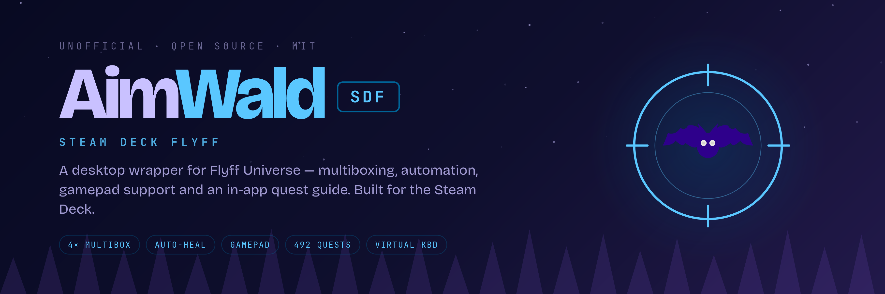

# AimWald-SDF (SteamDeckFlyff)

<p align="center">
  
</p>

<p align="center">
  <strong>Desktop wrapper for <a href="https://universe.flyff.com">Flyff Universe</a></strong><br>
  Multiboxing • Automation • Gamepad Support • Quest Guide
</p>

<p align="center">
  Built and optimized for the <strong>Valve Steam Deck</strong> (SteamOS) — also runs on any Linux desktop
</p>

---

## 💡 Why This Exists

Playing Flyff Universe in a web browser on the Steam Deck is incredibly uncomfortable. The game requires a lot of keyboard keys for normal gameplay — buffs, heals, skill rotations — which is painful to manage with the virtual keyboard and without proper gamepad mapping.

I'm not a programmer, but with modern AI assistance (Claude), building something like this became possible. This wrapper solves the core problems:
- **Gamepad control** that actually works (WASD movement, camera on right stick, mapped skill keys)
- **Multiboxing** for running a second character (or player shop) in the background
- **Automation** for repetitive actions (buff rotations, heal macros) so you can focus on gameplay instead of spamming keys

What started as a personal Steam Deck quality-of-life project turned into a full-featured wrapper with quest guides, auto-heal, and even a virtual keyboard — all built iteratively with AI.

### ⚠️ Use at Your Own Risk

**You can use this wrapper in two ways:**

1. **Safe Mode (Gamepad + Multibox only)** — Use only the gamepad controls, quest guide, and multiboxing features. These are quality-of-life improvements for comfortable Steam Deck gameplay with no automation.

2. **Automation Mode (Higher Risk)** — Enable auto-heal, buff timers, macros, or auto-targeting. **These features may violate Flyff Universe's Terms of Service** and could result in account suspension or ban. Ban risk is unknown and varies by feature.

**Automation Feature Risk Assessment:**
- **Auto-Heal/MP/FP** — Medium risk (detectable input patterns)
- **Buff/Heal Timers** — Medium risk (detectable timing patterns, includes ±10% randomization)
- **Macros** — Medium risk (rapid key sequences)
- **Auto-Targeting (Spiral)** — ⚠️ **Experimental/High risk** — unreliable, not recommended for regular use

**If you only want comfortable Steam Deck controls, simply don't enable any automation features.** The core gamepad mapping, multiboxing, and quest guide are safe quality-of-life improvements.

---

## ✨ Features at a Glance

- **Up to 4 accounts simultaneously** — Account 1 & 2 always loaded, Account 3 & 4 optional (e.g. player shop in background)
- **Auto-Heal/MP/FP** — Pixel-based or bar-scan monitoring with multiple thresholds per bar
- **Automation Engine** — Timed buff/heal rotations that run even on background accounts
- **Macro Buttons** — Toolbar buttons for full buff sequences (configurable key lists)
- **Follow + Board Hotkey** — Press one button to send Z + Alt+6 (for follow + mount) to any account
- **Gamepad Control** — Full Steam Deck layout with WASD movement, camera control (right stick = arrow keys), and auto-targeting
- **Virtual Keyboard** — Built-in on-screen keyboard (F8 toggle) — no need to open Steam's overlay
- **Madrigal Guide** — 492 quests, 36 questlines, daily quests, with progress tracking and export/import
- **Quest Progress Export/Import** — Backup your quest data as JSON; survives AppImage updates

---

## 📥 Installation

### Steam Deck (One-Command Install)

Open Konsole (Desktop Mode) and run:
```bash
curl -L https://raw.githubusercontent.com/AimWald/aimwald-sdf/main/install.sh | sh
```

This will:
- Download the latest AppImage
- Install to your home directory (`$HOME`)
- Create launch script with proper environment variables
- Clean up old AppImage extracts

Then add `$HOME/launch-sdf.sh` as a **Non-Steam Game**:
1. Open Steam (Desktop Mode)
2. Games → Add a Non-Steam Game → Browse
3. Select `$HOME/launch-sdf.sh` (typically `/home/deck/launch-sdf.sh`)
4. Add to Steam

**⚠️ CRITICAL: Enable Touchscreen Support (Steam Deck)**

After adding to Steam, you **MUST** configure the Steam Controller settings for touchscreen to work properly:

1. In Steam (Desktop Mode), right-click **AimWald-SDF** → **Manage** → **Controller Layout**
2. Navigate to **Action Sets** tab
3. Find **Always On Commands** (under System)
4. Enable **Touchscreen Native Support**
5. Save and exit

**Without this setting, the Steam Deck touchscreen will not work in the app!**

**⚠️ CRITICAL: In-Game Keybind Setup**

You **MUST** configure this keybind in Flyff Universe game settings for the B button to work:

1. Launch the game
2. Open **Settings** (Esc → Settings)
3. Go to **Keybinds**
4. Find **Clear Target**
5. Set it to **`.`** (period/dot key)
6. Save settings

**Without this keybind, the B button (Clear Target) will not work!**

**Install Custom Artwork (Automated)**

The installer downloads artwork automatically. To apply it:
```bash
cd $HOME
./install-steam-artwork.sh
```
The script detects your game's App ID and installs all artwork (Grid, Hero, Logo). Restart Steam to see changes.

**Manual: Via Steam UI**

Download artwork manually:
- **Grid** (Library): [steam-grid.png](https://github.com/AimWald/aimwald-sdf/raw/main/build/steam-grid.png) (460×215)
- **Hero** (Background): [steam-hero.png](https://github.com/AimWald/aimwald-sdf/raw/main/build/steam-hero.png) (1920×620)
- **Logo** (Overlay): [steam-logo.png](https://github.com/AimWald/aimwald-sdf/raw/main/build/steam-logo.png) (transparent)

Apply in Steam (Desktop Mode):
1. Right-click game → **Manage** → **Set custom artwork** (Grid)
2. Right-click game → **Manage** → **Set custom background** (Hero)
3. Right-click game → **Manage** → **Set custom logo** (Logo overlay)

### Manual Installation (Linux)

1. Download the latest `AimWald-SDF.AppImage` from [Releases](https://github.com/AimWald/aimwald-sdf/releases)
2. Make it executable: `chmod +x AimWald-SDF.AppImage`
3. Run: `./AimWald-SDF.AppImage`

### Manual Steam Deck Setup (Advanced)

1. Copy `AimWald-SDF.AppImage` to your home directory (`$HOME`, typically `/home/deck/`)
2. Create a launch script `$HOME/launch-sdf.sh`:

```bash
#!/bin/bash
# Clean up old extracted AppImage directories to free /tmp space
rm -rf /tmp/appimage_extracted_*

# Gaming Mode display configuration
export DISPLAY=${DISPLAY:-:0}
export WAYLAND_DISPLAY=${WAYLAND_DISPLAY:-gamescope-0}
export GAMESCOPE_WAYLAND_DISPLAY=${GAMESCOPE_WAYLAND_DISPLAY:-gamescope-0}
export XDG_RUNTIME_DIR=${XDG_RUNTIME_DIR:-/run/user/$(id -u)}

# Use X11 for Electron/Ozone (more stable than Wayland in Gaming Mode)
export ELECTRON_OZONE_PLATFORM_HINT=x11

# Disable input method modules that can cause crashes
export XMODIFIERS=""
export GTK_IM_MODULE=""
export QT_IM_MODULE=""

# Execute AppImage with proper quoting and flags
"$HOME/AimWald-SDF.AppImage" --appimage-extract-and-run --disable-gpu-sandbox --no-sandbox
```

3. Make it executable: `chmod +x $HOME/launch-sdf.sh`
4. Add `$HOME/launch-sdf.sh` as a **Non-Steam Game** in Steam
5. Launch from Game Mode

### Build from Source

```bash
git clone https://github.com/AimWald/aimwald-sdf.git
cd aimwald-sdf
npm install
npm start              # dev mode
npm run build          # builds dist/AimWald-SDF.AppImage
```

---

## 🎮 Multiboxing (Up to 4 Accounts)

### Account 1 & 2
- **Always loaded** — each has isolated cookies/login state
- Full automation support (buff/heal/macros)
- Switch with **F9** (configurable in Settings → Hotkeys)
- Cannot be closed

### Account 3 & 4
- **Optional** — open via `+ Acc3` / `+ Acc4` buttons in toolbar
- Ideal for player shops running in background
- **Switch-only** — no automation buttons (just account switching)
- Close via `✕ Acc3` / `✕ Acc4` buttons

Only one account is visible at a time. Inactive accounts keep running in the background — automation continues.

---

## 💊 Auto-Heal / MP / FP

Automatically presses configured keys when HP/MP/FP drops below thresholds. Runs on **background accounts** too (no need to keep them visible).

### Setup

1. **Settings → Auto-Heal** tab
2. Choose **Bar** or **Pixel** mode for each bar (HP, MP, FP)

### Bar Mode (recommended)
- Make bars **completely full**
- Click **📐** next to the bar
- Drag-select the bar area in the screenshot
- App calibrates left/right edges automatically
- Add actions: Key + Threshold % (e.g. Key `1` at `< 50%`)
- Multiple actions per bar supported (e.g. heal at 50%, emergency heal at 20%)

### Pixel Mode
- Make bar **completely full**
- Switch dropdown to **Pixel**, click **📍**
- Click once on the bar at your desired threshold position
- Add action: Key + Threshold ratio (50 = safe default)

### Test
Press **🔍** to test current reading without waiting for the heal cycle.

---

## ⚙️ Automation (Buff / Heal Timers)

Sends keypresses at fixed intervals — runs even when the account is in the background.

### Setup
1. **Settings → Automation** tab
2. Per account: Label, Key (1–0, F1–F12), Interval (ms), Enable checkbox
3. `+ Add action` to add more, `✕` to remove
4. **💾 Save** — running automations restart immediately

### Control
- **Toolbar:** `▶ Acc1` / `■ Acc1` and `▶ Acc2` / `■ Acc2`
- **Hotkey:** **F10** (configurable) toggles automation for the active account
- Green toolbar buttons = automation running

**Default actions (disabled by default):**
| Label | Key | Interval |
|-------|-----|----------|
| Heal | 1 | 3,000 ms |
| Buff 1 | 2 | 30,000 ms |
| Buff 2 | 3 | 30,000 ms |

---

## 🚢 Follow + Board Hotkey

Sends **Z** (follow) + **Alt+6** (board) in sequence.

### Usage
- **Hotkey:** `,` (comma, configurable in Settings → Hotkeys) — sends to **active account**
- **Toolbar buttons:** `⛵ Acc1` and `⛵ Acc2` — send to **specific account** (even if in background)

Example: You're on Acc1, press the `⛵ Acc2` button → Acc2 executes follow+board in the background without switching views.

---

## 🛡️ Anti-Detection (Randomized Timing)

All automation intervals include **±10% random variation** to avoid constant timing patterns that might trigger anti-cheat detection. This makes automated actions appear more human-like.

**Example:**
- You set interval: `2000 ms`
- Actual interval: randomly varies between `1800–2200 ms` each execution

**Applies to:**
- **Automation timers** (buff/heal rotations)
- **Auto-Heal polling** (HP/MP/FP check intervals)
- **Macro key delays**

No configuration needed — randomization is built-in and automatic.

---

## 🎮 Gamepad Support (Steam Deck)

**⚠️ Important Setup Required:**
1. **Touchscreen:** Enable **Touchscreen Native Support** in Steam Controller settings
2. **Clear Target (B button):** Set **Clear Target** keybind to **`.`** in Flyff Universe game settings

See the [Installation section](#-installation) for detailed setup instructions.

### Default Button Layout

| Button | Action |
|--------|--------|
| A (0) | Left click (attack / select) |
| B (1) | `.` — Clear target |
| X (2) | Key `3` |
| Y (3) | Space (Jump) |
| L1 (4) | Key `1` (Heal) |
| R1 (5) | Key `2` (Buff) |
| L2 (6) | Right click hold (for camera drag — not needed with right-stick arrow keys) |
| R2 (7) | Key `4` |
| Back (8) | Escape |
| Start (9) | M (Map) |
| D-Pad ↑ (12) | Scroll in (zoom) |
| D-Pad ↓ (13) | Scroll out (zoom) |
| D-Pad → (15) | Tab (switch skill bar) |

### Sticks
- **Left stick:** WASD movement (hysteresis: press at 0.40, release at 0.20 to prevent jitter)
- **Right stick:** Arrow keys (camera control) — mapped to ↑↓←→ for smooth in-game camera rotation

No L2-hold required for camera anymore.

### Auto-Targeting (⚠️ Experimental)

Assign `__TARGET` to any button in **Settings → Controller** inside the app. When pressed, a spiral cursor sweeps from screen center and clicks the first hovered target. Configure search radius in **Settings → Controller → Auto-Target**.

**⚠️ Warning:** This feature is **experimental and unreliable**. It may miss targets, click wrong locations, or behave unpredictably. **Ban risk is unknown.** Use at your own risk. Not recommended for regular gameplay.

---

## Controller Configuration: Two Layers Explained

There are **two places** to configure controller buttons, and understanding the difference is important:

### 1️⃣ In-App Settings (Settings → Controller)

Configure the **main gamepad buttons** (A/B/X/Y, L1/R1/L2/R2, D-Pad, Start/Back) here:
- All 20 buttons (0–19) are remappable
- Change what keyboard keys they send to the game
- Configure auto-targeting (`__TARGET` special function)
- These settings apply to the physical Steam Deck buttons

**Example:** Change X button from `3` to `5`, or map D-Pad ↑ to `P` for Party Window.

### 2️⃣ Steam Controller Layout (Steam → Manage → Controller Layout)

Configure **extra inputs** that the app doesn't handle natively:
- **Back buttons** (L4/R4/L5/R5) — not accessible in-app, must configure in Steam
- **Right trackpad** — set to Mouse mode + Left Click for precise cursor control
- **Gyro** — if you want motion controls
- **Touchscreen Native Support** ⚠️ **REQUIRED** — enable in Action Sets → Always On Commands

**Recommended Steam-only mappings:**
- **L4**: `F9` (Account Switch) — quick multibox switching
- **R4**: Automation toggle hotkey or macro button
- **Right Trackpad**: Mouse mode + Left Click action

### ⚡ Quick Decision Guide

| What do you want to change? | Where to configure it? |
|------------------------------|------------------------|
| A/B/X/Y buttons, D-Pad, L1/R1/L2/R2 | **In-App** (Settings → Controller) |
| Back buttons (L4/R4/L5/R5) | **Steam Controller Layout** |
| Right trackpad behavior | **Steam Controller Layout** |
| Touchscreen support | **Steam Controller Layout** (Action Sets) |
| Auto-targeting | **In-App** (Settings → Controller) |

### 💡 Recommended Workflow

1. **Start with in-app defaults** — they're optimized for Flyff gameplay
2. **Add Steam-only features** — back buttons for F9 (account switch), right trackpad as mouse
3. **Enable touchscreen** in Steam Action Sets (CRITICAL!)
4. **Optionally override D-Pad** in Steam if you prefer UI shortcuts (P/H/I) over zoom

This two-layer system gives you maximum flexibility: the app handles core combat controls, Steam handles extra hardware features.

---

## 🎹 Virtual Keyboard

Built-in on-screen keyboard overlay — no need for Steam's sidebar.

- **Toggle:** Press **F8** or click **🔤** in toolbar
- Sends keys directly to the active game view
- Stays open when you click between chat fields (unlike Steam keyboard)
- Includes: QWERTY layout + numbers + Backspace/Enter/Space

---

## 🗺️ Madrigal Guide

Click **📖 Guide** in the toolbar to open the in-app overlay.

### Quests Tab
- **492 quests** (Lv. 1–183) sourced from NaviKnight2765's spreadsheet
- Columns: Level, Questline, Name, Recommendation, Exp, Difficulty, Items, Monsters, Inventory slots, Rewards, Notes
- **Filter bar:** Open / Done / Skipped / All (default: Open)
- **Status tracking:** Radio buttons per quest — Open (○), Done (✓), or Skipped (⊗)
- **Live search** across all fields
- Click quest name → opens Flyffipedia detail page

### Questlines Tab
- **36 questlines** with start NPC, location, level range
- **Green progress bar:** quests completed (excludes skipped)
- **Orange bar:** inventory slots unlocked so far
- Click row → filters Quests tab to that questline

### Dailies Tab
- **Forsaken Tower** (Lv. 86–152) and **Kaillun** (Lv. 162–172)
- **Your Level** input: filters to quests at or below your level
- Columns: Level, Name, Exp, Monsters to kill, Penya

### Monsters Tab
- Quick reference grid for 53 monsters

### Export / Import Progress
- **📤 Export Progress** → saves quest data as JSON file (backup before updates)
- **📥 Import Progress** → restores from backup
- Your progress is stored in `~/.config/flyff-wrapper/` and survives AppImage updates

---

## 🔘 Macro Buttons

Macros fire key sequences with configurable delays. Each macro becomes a toolbar button.

**Default macros:**
- **Full Buff Acc1** — `F2, 1, 2, 3, 4, 5, 6, 7, 8, 9, F1` with 200ms delay
- **Full Buff Acc2** — same sequence for Acc2

### Setup
1. **Settings → Macros** — Label, Account (1–4), Keys (comma-separated), Delay (ms)
2. `+ Add macro` / `✕` to manage
3. **💾 Save** — button appears immediately in toolbar

Automation on the target account pauses during macro execution and resumes after.

---

## ⌨️ Hotkeys

| Key | Action | Configurable |
|-----|--------|:---:|
| **F9** | Switch active account | ✅ |
| **F10** | Toggle automation on active account | ✅ |
| **`,`** | Follow + Board (Z + Alt+6) on active account | ✅ |
| **F11** | Toggle fullscreen | ❌ |

**Note:** F8 is no longer used for virtual keyboard (conflicts with in-game Action Bar 8). Use the **🔤** toolbar button instead.

**Important:** Wrapper hotkeys (F9, F10, comma) are captured globally and **will not reach the game**. If you need F9/F10 in-game (Action Bar switching), change the wrapper hotkeys in **Settings → Hotkeys** to different keys.

Change configurable hotkeys in **Settings → Hotkeys**.

---

## ⚙️ Settings Overview

Open with **⚙ Settings** in the toolbar.

| Tab | What it does |
|-----|-------------|
| **Automation** | Per-account buff/heal action lists (key + interval + enable) |
| **Controller** | Gamepad button mapping (0–19), auto-target radius |
| **Accounts** | Reset session per account (clear cookies / force re-login) |
| **Hotkeys** | Account switch, automation toggle, follow+board |
| **Macros** | Toolbar macro buttons (key sequences) |
| **Auto-Heal** | HP/MP/FP monitoring — Bar or Pixel mode per bar |

Click **💾 Save** to apply. Running automations restart immediately — no app restart needed.

---

## 📦 AppImage Updates

All user data is stored in `~/.config/flyff-wrapper/`:
- Automation config
- Gamepad config
- Macros
- Auto-Heal calibration
- Quest progress

**AppImage updates do NOT overwrite your settings.** Just replace the `.AppImage` file and re-run.

Use **Export Progress** in the Guide for an extra backup before updating.

---

## 🛠️ Development

```bash
git clone https://github.com/AimWald/aimwald-sdf.git
cd aimwald-sdf
npm install
npm start              # dev mode (Electron + devtools)
npm run build          # builds dist/AimWald-SDF.AppImage
```

Deploy to Steam Deck:
```bash
scp dist/AimWald-SDF.AppImage deck@<deck-ip>:~/
# Or run the installer again to update
```

---

## 🙏 Credits

**Quest data** (492 quests, 36 questlines, difficulty ratings, recommendations, inventory slot tracking) sourced from the spreadsheet by **NaviKnight2765**:
- Reddit: [u/NaviKnight2765](https://www.reddit.com/user/NaviKnight2765/)
- Original post: [I made a spreadsheet with detailed info about all quests and drops](https://www.reddit.com/r/FlyffUniverse/comments/1k0n6mo/i_made_a_spreadsheet_with_detailed_info_about_all/)

**Auto-targeting spiral search** inspired by [Ariorh1337/flyff_bot](https://github.com/Ariorh1337/flyff_bot).

---

## ⚠️ Disclaimer

This project is an **independent, community-driven wrapper** for Flyff Universe and is **not affiliated with, endorsed by, or sponsored by Gala Lab Corp., Galanet, or any official Flyff developers**.

- **Flyff Universe** is a trademark of Gala Lab Corp.
- This wrapper is provided **as-is** for educational and personal use.
- **Use at your own risk.** The author is not responsible for any consequences of using this software, including account suspensions, bans, or violations of Flyff Universe's Terms of Service.

### Risk Levels by Feature

**Safe for casual use** (Quality-of-life only):
- Gamepad controls (WASD, camera, button mapping)
- Multiboxing (multiple accounts)
- Quest guide
- Virtual keyboard

**Medium to High Risk** (May violate ToS):
- **Auto-Heal/MP/FP** — Automated input based on screen monitoring
- **Automation timers** — Timed buff/heal rotations (includes randomization to reduce detection)
- **Macros** — Rapid key sequences
- **Auto-Targeting** — Experimental cursor automation (unreliable, ban risk unknown)

**If you only want comfortable Steam Deck controls without automation, simply don't enable any automation features.** You can enjoy the wrapper safely with just gamepad mapping and the quest guide.

**The author assumes no liability for bans or ToS violations. Use automation features at your own discretion.**

**Support the official game:**  
If you enjoy Flyff Universe, consider supporting the developers by purchasing in-game items or subscribing to premium services at [universe.flyff.com](https://universe.flyff.com).

---

## 📜 License

MIT License — see [LICENSE](LICENSE) for details.

---

## 🐛 Issues & Feedback

Report bugs or request features at [github.com/AimWald/aimwald-sdf/issues](https://github.com/AimWald/aimwald-sdf/issues)

---

## 💬 About the Name

**AimWald-SDF** = **S**team**D**eck**F**lyff by AimWald

The project started as a personal quality-of-life wrapper for playing Flyff Universe on the Steam Deck, where the web browser experience is uncomfortable and lacks proper gamepad support. With modern AI assistance (Claude), what began as a simple fix turned into a full-featured multiboxing wrapper with automation, quest guides, and more.
